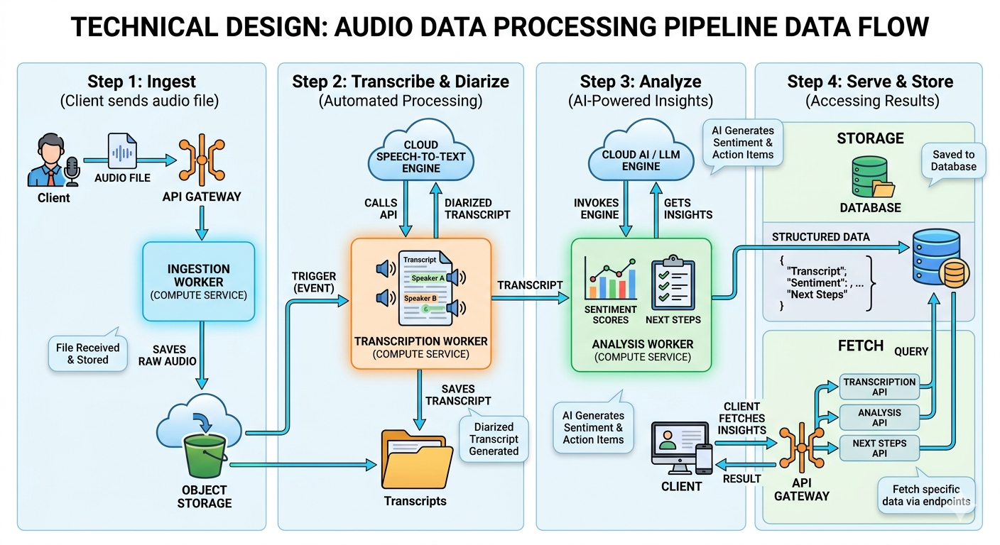

VoiceAI Application
VoiceAI is an advanced application that converts voice recordings into transcripts, performs conversation diarization, analyzes sentiment, and suggests next steps for agent interactions. 
It is designed to be cloud-agnostic and can be deployed across Azure, AWS, or GCP using Spark pools, ETL pipelines, or serverless architectures.
An intelligent Speech-to-Text system that transcribes audio and uses a language model to detect customer identity cues and emotional sentiment from spoken conversations.

##High Level Design and Architecture

Features
Voice-to-Text Conversion: Converts audio files (WAV, MP3, etc.) into accurate transcripts.
Speaker Diarization: Identifies individual speakers in a conversation.
Sentiment Analysis: Evaluates the emotional tone of the conversation.
Next Steps Recommendation: Provides actionable suggestions for agent follow-ups.
Cloud-Agnostic: Supports Azure, AWS, and GCP using Spark, Dataflow, or ETL tools.

Tech Stack
- Python
- FastAPI
- Speech Recognition / ML model
- Use Azure, GCP, or AWS for architecture
- Built for Kubernetes

How to Run
1. Install dependencies, use container, or veiw requirements.txt file. 
2. Start the server:
   uvicorn app.main:app --reload

Authentication
All APIs require Bearer Token authentication:
You can generate an API key from your platform (Azure, AWS, GCP).
Tokens can be rotated periodically.

